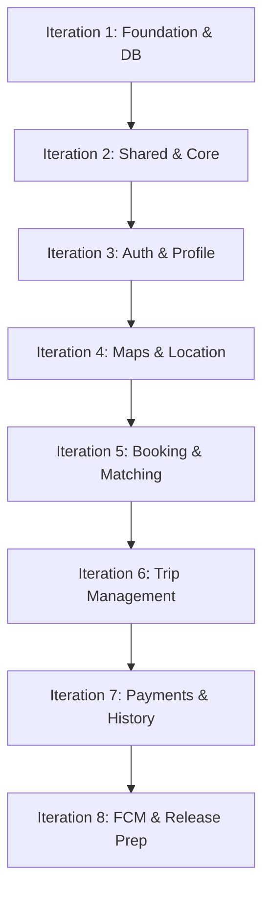

# Zeni - Implementation Iteration Plan

This document outlines the step-by-step implementation iteration plan for the **Zeni** ride-hailing platform. It details the development sprints, technical requirements, and verification milestones to guide the transition from a blank repository to a production-ready application.

---

## 🗺️ Execution Overview

The development is organized into **8 sequential iterations**. Each iteration has a clear functional goal, distinct deliverables, database implications, and testing procedures.

---

## 🌀 Detailed Iteration Plan

### 📌 Iteration 1: Repository Foundation & Database Setup
**Objective:** Establish the project structure, configure Supabase, and build the initial relational database schema with Row Level Security (RLS) policies.

*   **Repository & Folder Layout:**
    *   Initialize git and organize the project directories:
        *   `rider_app/` (Flutter project)
        *   `driver_app/` (Flutter project)
        *   `shared_packages/` (For models, services, widgets, utilities)
*   **Supabase Project Initialization:**
    *   Provision Supabase project instance.
    *   Enable PostgreSQL extensions: `postgis`, `pgcrypto`, `uuid-ossp`.
*   **Database Schema Creation:**
    *   Create `profiles` table linked to Supabase Auth `users`.
    *   Create role-specific tables: `passengers` and `drivers`.
    *   Create vehicle and document management tables: `vehicles` and `vehicle_documents`.
    *   Configure Row Level Security (RLS) for all tables to prevent cross-tenant data leakage.
*   **Verification:**
    *   Run test SQL migrations and verify schema constraints.
    *   Assert that unauthenticated requests are blocked by RLS policies.

---

### 📌 Iteration 2: Shared Packages & Core Mobile Infrastructure
**Objective:** Set up common dependencies, core configurations, and reusable modules shared by the Rider and Driver applications.

*   **Shared Packages Configuration:**
    *   Configure `shared_packages/models` with JSON serialization (using `freezed` or `json_serializable`) for core models: `Profile`, `Driver`, `Passenger`, `Vehicle`, `RideRequest`, `Ride`.
    *   Configure `shared_packages/services` with basic network clients (Dio wrapper, Supabase Client singleton) and key interfaces.
*   **Rider and Driver Project Scaffold:**
    *   Install main dependencies: `flutter_bloc`, `go_router`, `dio`, `flutter_secure_storage`, `shared_preferences`.
    *   Define core theme configurations, styles, and routing setup using GoRouter.
*   **Verification:**
    *   Ensure all shared packages compile without errors.
    *   Verify routing structure and global theme consistency in both application builds.

---

### 📌 Iteration 3: OTP Authentication & Profile Onboarding
**Objective:** Build secure authentication and onboarding flows for passengers and drivers.

*   **Supabase Auth Integration:**
    *   Implement Phone Number + OTP verification flow.
    *   Create authentication BLoC to handle state transitions (unauthenticated, verifying, authenticated).
*   **Passenger Onboarding & Profiles:**
    *   Build signup screen for passenger profile info (Name, Email, Emergency Contacts).
    *   Write profiles update trigger in Supabase.
*   **Driver Registration & Document Upload:**
    *   Build registration wizard for drivers: Vehicle details, Driver's License, Vehicle Registration, and Insurance.
    *   Integrate `image_picker` to upload documents to Supabase Storage (`driver_documents/` and `vehicle_photos/` buckets).
    *   Set driver status to `pending_approval`.
*   **Verification:**
    *   Test phone OTP login using dummy credentials in Supabase.
    *   Validate file uploads to Supabase storage buckets and confirm RLS rules permit read/write only to the owner.

---

### 📌 Iteration 4: Maps, Geolocation, and Live Location Tracking
**Objective:** Integrate maps and enable real-time location streaming from drivers to passengers.

*   **Google Maps Integration:**
    *   Configure iOS & Android API keys for Google Maps SDK.
    *   Implement location permission requests (using `permission_handler`).
    *   Render Map UI centered on current location (using `geolocator`).
*   **Driver Real-Time Location Publishing:**
    *   Implement background location tracker in Driver App.
    *   Publish current coordinates to Supabase `ride_locations` table at standard intervals.
*   **Passenger Map View:**
    *   Fetch and display nearby active drivers (using PostGIS query on `ride_locations`).
    *   Enable live map pins update via Supabase Realtime subscriptions.
*   **Verification:**
    *   Simulate mock GPS movement in Driver App and ensure coordinates update correctly in the database.
    *   Verify the Rider map renders driver marker movements smoothly in real time.

---

### 📌 Iteration 5: Ride Request & Matching Workflow
**Objective:** Orchestrate the core ride request, broadcast, and driver acceptance flow.

*   **Passenger Booking Interface:**
    *   Build destination picker with Google Places autocomplete.
    *   Implement route overview on the map and calculate estimated fare (using Google Directions API and Distance Matrix).
    *   Allow passenger to select payment method and request a ride (creates entry in `ride_requests`).
*   **Driver Dispatching System:**
    *   Use Supabase Realtime to broadcast new `ride_requests` to drivers within a configured radius.
    *   Build Driver incoming request screen (displays pickup, destination, fare, and accept/decline action buttons).
*   **Match Allocation Logic:**
    *   Handle transaction safety when a driver clicks "Accept" to prevent race conditions.
    *   Link driver to the `rides` table, set status to `accepted`, and notify passenger.
*   **Verification:**
    *   Test concurrent bookings: ensure a request is correctly assigned to the first accepting driver and dismissed for others.
    *   Verify passenger app receives immediate UI update upon driver acceptance.

---

### 📌 Iteration 6: Active Trip Management & In-Ride Features
**Objective:** Manage the trip lifecycle from pickup to drop-off.

*   **Driver Trip Lifecycle Actions:**
    *   Status transition controls: `arrived` (at passenger location) -> `started` (passenger boards) -> `completed` (reached destination).
*   **Live Route Tracking:**
    *   Show live navigation map in Driver App.
    *   Show current route and estimated time of arrival (ETA) dynamically to the passenger.
*   **In-App Safety & Communication:**
    *   Implement quick call/chat integration (dummy client-side routing to system dialer or basic real-time table sync chat).
    *   Implement an SOS Emergency button to trigger mock alert signals in database.
*   **Verification:**
    *   Perform a mock walk-through of the entire trip state machine.
    *   Ensure all state changes write correctly to `ride_status_history` and trigger UI updates.

---

### 📌 Iteration 7: Payment Integrations & History
**Objective:** Support cash, card (Yoco), and mobile money (MTN MoMo) transactions and expose ride summaries.

*   **Payment Gateways Integration:**
    *   **Cash:** Simple flag, marks ride as pending payment completion, confirmed by driver.
    *   **Yoco Card Payment:** Integrate Yoco Flutter SDK/Webview to authorize and capture card payments.
    *   **MTN MoMo:** Implement API integration callback triggers to initiate mobile money USSD push requests.
*   **Post-Trip Reviews & Ratings:**
    *   Build rating screen for passengers (rate driver out of 5 stars, submit review to `ratings`/`reviews`).
    *   Update driver's average rating asynchronously via a Supabase database function.
*   **Trip History & Invoicing:**
    *   Render past trips list with routes, payment method, date, and receipt overview in both apps.
*   **Verification:**
    *   Test payment gateway integrations using sandbox credentials (Yoco test cards & MTN MoMo test numbers).
    *   Confirm driver rating average recalculates correctly in `drivers` profile after submitting a rating.

---

### 📌 Iteration 8: Push Notifications, Security, & Release Prep
**Objective:** Finalize user notifications, perform comprehensive security checks, and build release packages.

*   **Push Notifications (FCM):**
    *   Register device tokens in `device_tokens` table.
    *   Write Supabase Edge Functions or database triggers to send FCM notifications when ride status changes (e.g., driver arrived).
*   **Security Review & Optimization:**
    *   Conduct RLS audit to guarantee users cannot read or write others' data.
    *   Verify all sensitive API keys (Google Maps, Yoco, Supabase) are managed via secure environmental configurations.
*   **Build & Deployment Setup:**
    *   Set up icons, splash screens, and signing certificates for both apps.
    *   Configure CI/CD or build scripts to compile release APK/AAB for Android and IPA for iOS.
*   **Verification:**
    *   Verify notification reception when the app is in the background/foreground.
    *   Run static analysis (`flutter analyze`) to resolve any remaining code quality issues.

---

## 📊 Database Schema Blueprint

The tables planned for implementation in **Iteration 1**:

| Table Name | Primary Purpose | Real-Time Sync Enabled |
| :--- | :--- | :---: |
| `profiles` | Shared user profile info synced from auth.users | No |
| `passengers` | Passenger-specific metadata & ratings | No |
| `drivers` | Driver-specific documents, ratings, & status | Yes |
| `vehicles` | Vehicles linked to drivers | No |
| `vehicle_documents` | Verification documents linked to vehicles | No |
| `ride_requests` | Active booking request details | Yes |
| `rides` | Ongoing and completed trips records | Yes |
| `ride_locations` | Realtime GPS tracks of active drivers | Yes |
| `ride_status_history` | Timestamp log of state shifts | No |
| `ratings` / `reviews` | Feedback scores and review text | No |

---

> [!IMPORTANT]
> **Key Dependencies:**
> 1. Google Maps Platform API credentials must be set up prior to Iteration 4.
> 2. Yoco merchant account and MTN MoMo sandbox keys are required before starting Iteration 7.
> 3. Google/Apple developer accounts are required for testing push notifications on physical devices.
